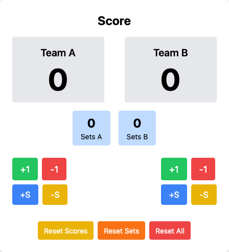

# score-counter

- download index.html file
- in OBS, add a "Browser" source
	- local file
	- point it to the index.html file
	- once becomes visible in the scene, right click, select "Interact" - will allow updating the score.

